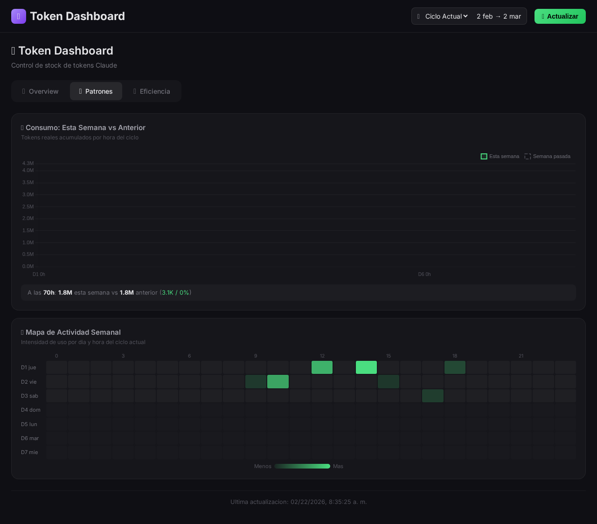
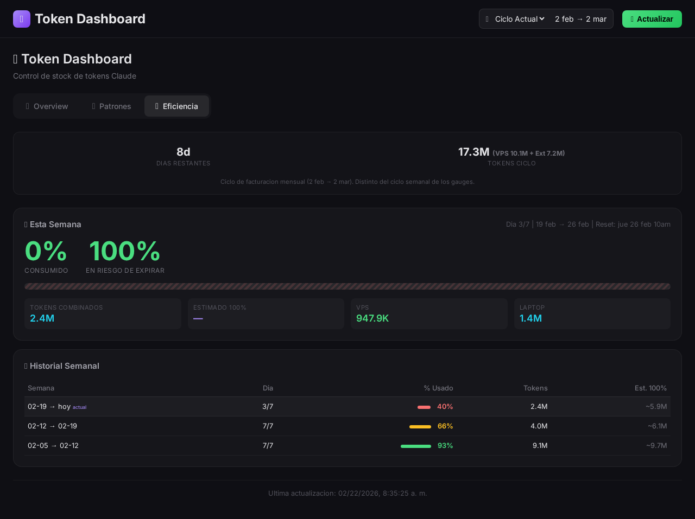

# Claude Code Usage Dashboard

Real fuel monitoring for Claude Code. Track the tokens that **actually burn your weekly quota**, ignoring cache reads (~96% of volume) that cost nothing.

> Stop guessing. Know exactly how much Claude Code fuel you have left.

## Why This Exists

Claude Code has a weekly token limit. Burn it all and you're locked out until reset. But ~96% of reported tokens are **cache reads** — they don't count against your quota. This dashboard separates signal from noise.

**What it tells you:**

- **How much fuel is left** — Real weekly % (direct from Claude `/usage`)
- **Your burn rate** — Weekly pace with alerts if you're running hot
- **When you'll run out** — Projected depletion day
- **Daily real cost** — Actual tokens, not inflated with cache reads

## What It Measures (and What It Doesn't)

| Token Type | Counted? | Why |
|-----------|----------|-----|
| outputTokens | Yes | What Claude generates — costs quota |
| inputTokens | Yes | New context — costs quota |
| cacheCreationTokens | Yes | First cache write — costs quota |
| **cacheReadTokens** | **No** | ~96% of volume, free or near-free |

**Formula:** `realTokens = totalTokens - cacheReadTokens`

See `TECHNICAL-NOTES.md` for the full methodology.

## Screenshots


*Main dashboard showing real token consumption, weekly pace, and daily patterns*

  
*Activity heatmap and weekly comparison charts*


*Billing cycle progress and weekly efficiency history*

> **Note:** Screenshots will be added once browser automation is available. The dashboard is fully functional — run `node server.js` and visit `http://localhost:3400` to see it live.

## Stack

```
Node.js + Express
Frontend: Vanilla HTML/CSS/JS + Chart.js (single index.html, no build step)
Data: ccusage (parses JSONL logs) + Claude /usage (via PTY)
Process Manager: PM2 (optional)
```

## Prerequisites

- **Node.js** 18+
- **Claude Code** installed and authenticated
- **Build tools** (required by `node-pty` native module):

| OS | Install command |
|----|----------------|
| Ubuntu/Debian | `sudo apt install build-essential python3` |
| macOS | `xcode-select --install` |
| Windows | `npm install -g windows-build-tools` |

## Quick Start

Works on any machine where Claude Code is installed. Reads `~/.claude/` logs automatically.

```bash
# Clone
git clone https://github.com/ronaldmego/claude-code-usage-dashboard.git
cd claude-code-usage-dashboard

# Install
npm install

# Run
node server.js
```

Open `http://localhost:3400` in your browser. That's it — the dashboard reads your local Claude Code logs and fetches account-level usage via PTY automatically.

### Optional: PM2 for background running

```bash
pm2 start server.js --name claude-usage-dashboard
```

### Optional: Custom configuration

```bash
cp .env.example .env
# Edit .env — set host, port, etc.
```

| Variable | Default | Description |
|----------|---------|-------------|
| `DASHBOARD_HOST` | `127.0.0.1` | Bind address |
| `DASHBOARD_PORT` | `3400` | Server port |
| `DASHBOARD_TIMEZONE` | `-5` | UTC offset in hours (e.g., `-5` for EST, `+1` for CET, `0` for UTC) |
| `CLAUDE_LOGS_DIR` | `~/.claude` | Path to Claude Code JSONL logs |

## Architecture

### Single machine (default)

```
~/.claude/*.jsonl  ──>  ccusage (parser)  ──>  server.js  ──>  Dashboard
                                                   ^
Claude Code (/usage PTY)  ──>  claude-usage.js  ───┘
```

- **ccusage** parses your local JSONL logs every 5 min for token breakdowns
- **claude-usage.js** runs Claude Code's `/usage` command via PTY to get account-level percentages

### Multi-machine (optional)

If you use Claude Code on multiple machines, remote instances can push their data to a central dashboard:

```
Remote machine  ──>  push-usage.sh  ──POST /api/external-usage──>  Dashboard (merged)
```

See [Multi-Machine Sync](#multi-machine-sync) below.

## Multi-Machine Sync

> **Optional.** Only needed if you run Claude Code on more than one machine.

If you have multiple machines (e.g., a laptop and a server), you can sync usage data from remote machines to a central dashboard instance. The script `push-usage.sh` runs ccusage locally on the remote machine and POSTs the data.

See `LOCALSETUP.md` for detailed setup instructions (hooks, scheduled tasks, troubleshooting).

## Documentation

| File | Contents |
|------|----------|
| `CLAUDE.md` | Guide for Claude Code (philosophy, architecture, commands) |
| `TECHNICAL-NOTES.md` | Measurement methodology: real fuel vs cache reads |
| `LOCALSETUP.md` | Multi-machine sync setup (optional) |
| `LIMITATIONS.md` | Known data source limitations |
| `CHANGELOG.md` | Version history |

## Design Philosophy

- **Zero build step** — No React, no webpack. Vanilla JS + Chart.js.
- **Single dependency** — Express. That's it.
- **Real metrics only** — Cache reads are noise. We filter them out.
- **Works anywhere** — Single machine by default, multi-machine if you need it.

## License

MIT

## Contributing

PRs welcome! Open an issue first for major changes.
