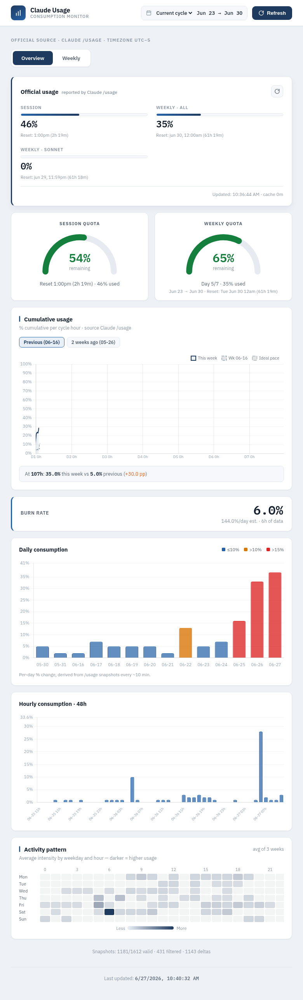
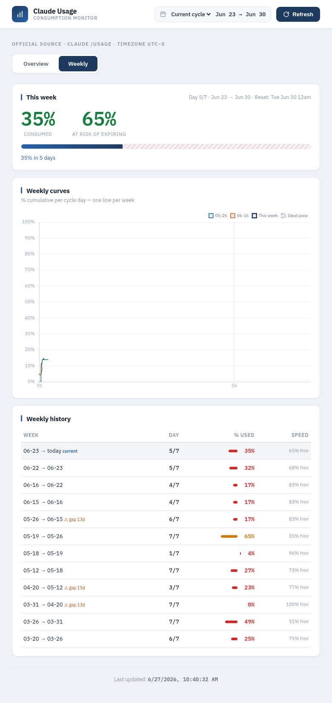

<p align="center">
  
</p>

<p align="center">
  <a href="https://github.com/ronaldmego/ccfuel/actions/workflows/ci.yml"></a>
  <a href="LICENSE"></a>
</p>

**Fuel gauge for Claude Code.** Track the tokens that **actually burn your weekly quota**, ignoring cache reads (~96% of volume) that cost nothing.

> Stop guessing. Know exactly how much Claude Code fuel you have left.

## Why This Exists

Claude Code has a weekly token limit. Burn it all and you're locked out until reset. But ~96% of reported tokens are **cache reads** — they don't count against your quota. This dashboard separates signal from noise.

**What it tells you:**

- **How much fuel is left** — Real weekly % (direct from Claude `/usage`)
- **Your burn rate** — Weekly pace with alerts if you're running hot
- **When you'll run out** — Projected depletion day
- **Daily real cost** — Actual tokens, not inflated with cache reads

## What It Measures (and What It Doesn't)

| Token Type | Counted? | Why |
|-----------|----------|-----|
| outputTokens | Yes | What Claude generates — costs quota |
| inputTokens | Yes | New context — costs quota |
| cacheCreationTokens | Yes | First cache write — costs quota |
| **cacheReadTokens** | **No** | ~96% of volume, free or near-free |

**Formula:** `realTokens = totalTokens - cacheReadTokens`

See `TECHNICAL-NOTES.md` for the full methodology.

## Screenshots


*Overview — official usage, session/weekly quota gauges, burn rate, and daily/hourly consumption with an activity heatmap*


*Weekly — cycle progress, cumulative curves per week, and weekly history*

## Stack

```
Node.js + Express
Frontend: Vanilla HTML/CSS/JS + Chart.js (single index.html, no build step)
Data: Claude /usage (via PTY) — periodic % snapshots
Process Manager: PM2 (optional)
```

## Prerequisites

- **Node.js** 18+
- **Claude Code** installed and authenticated
- **Build tools** (required by `node-pty` native module):

| OS | Install command |
|----|----------------|
| Ubuntu/Debian | `sudo apt install build-essential python3` |
| macOS | `xcode-select --install` |
| Windows | `npm install -g windows-build-tools` |

## Quick Start

Works on any machine where Claude Code is installed. Reads `~/.claude/` logs automatically.

```bash
# Clone
git clone https://github.com/ronaldmego/ccfuel.git
cd ccfuel

# Install
npm install

# Run
node server.js
```

Open `http://localhost:3400` in your browser. That's it — the dashboard reads your local Claude Code logs and fetches account-level usage via PTY automatically.

### Optional: PM2 for background running

```bash
cp ecosystem.config.example.cjs ecosystem.config.cjs
pm2 start ecosystem.config.cjs
```

### Optional: Custom configuration

```bash
cp .env.example .env
# Edit .env — set host, port, etc.
```

| Variable | Default | Description |
|----------|---------|-------------|
| `DASHBOARD_HOST` | `127.0.0.1` | Bind address |
| `DASHBOARD_PORT` | `3400` | Server port |
| `DASHBOARD_TIMEZONE` | `-5` | UTC offset in hours (e.g., `-5` for EST, `+1` for CET, `0` for UTC) |
| `DASHBOARD_COLLECT_INTERVAL_MIN` | `10` | Server-side auto-collector cadence in minutes. `0` disables it |
| `CLAUDE_LOGS_DIR` | `~/.claude` | Path to Claude Code JSONL logs |

## Architecture

### Single machine (default)

```
Claude Code (/usage PTY)  ──>  claude-usage.js  ──>  server.js  ──>  Dashboard
```

- **claude-usage.js** runs Claude Code's `/usage` command via PTY to get account-level percentages
- An in-process auto-collector in `server.js` fetches `/usage` and saves a snapshot to `data/usage-curve.json` every `DASHBOARD_COLLECT_INTERVAL_MIN` minutes (default 10), independent of whether the dashboard is open. It primes once ~5s after boot and is guarded against overlapping PTY spawns. Opening the dashboard or hitting `/api/global-usage` still triggers an on-demand refresh on top of the schedule.

### File Structure

```
ccfuel/
├── server.js           # Express server + PTY integration
├── claude-usage.js     # PTY wrapper for Claude /usage
├── public/
│   └── index.html      # Dashboard (all inline: HTML, CSS, JS)
├── data/               # Local snapshots (gitignored, created at runtime)
│   ├── weekly-history.json  # Weekly efficiency snapshots
│   └── usage-curve.json     # Periodic % snapshots (~every 10 min)
├── TECHNICAL-NOTES.md  # Measurement methodology
├── LIMITATIONS.md      # Known limitations
└── package.json
```

### API Endpoints

| Endpoint | Method | Description |
|----------|--------|-------------|
| `/` | GET | Dashboard HTML |
| `/api/refresh` | GET | Redirects to `/api/global-usage/refresh` |
| `/api/global-usage` | GET | Real global usage (Claude /usage via PTY) |
| `/api/global-usage/refresh` | GET | Force refresh global usage |
| `/api/usage-curve` | GET | Periodic % snapshots (for weekly comparison) |
| `/api/usage-deltas` | GET | Derived consumption from % deltas (rate, projection, daily, hourly, heatmap, curves) |
| `/api/weekly-history` | GET | Weekly efficiency history |
| `/api/config` | GET | Configuration (timezone) |

**Global Usage:** Executes Claude Code via PTY (~15-20s), cached 5 min. Returns session%, weekAll%, weekSonnet%, extraUsage.

**Usage Curve:** Each successful global-usage fetch saves a snapshot to `data/usage-curve.json` (%, hour, cycle day). Auto-pruned to last 28 days.

### Dashboard Tabs

- **Consumption (main):** Derived from % deltas via /usage snapshots. Current rate (%/hour, last 6h), depletion projection, daily consumption (14 days), hourly consumption (48h), current cycle intensity heatmap. Source: `/api/usage-deltas`.
- **Overview:** Global usage (source of truth: session %, weekly, sonnet), session and weekly gauges (% remaining). Source: `/api/global-usage`.
- **Patterns:** Line chart with cumulative % (0-100%) per cycle hour. Current week (green) vs previous (gray) vs ideal pace (purple). Source: `curves` in `/api/usage-deltas`.
- **Efficiency:** Current weekly efficiency (% used vs available, colors relative to cycle progress), previous weeks history. Source: `/api/weekly-history`.

## Critical Components

### claude-usage.js — The Data Engine

`claude-usage.js` is the **single most critical file** in this project. It is the data extraction layer — without it, the entire dashboard shows 0% on everything. The UI is just presentation; this file is the engine.

#### How it works

```
node-pty spawns `claude` → waits 4s for init → types `/usage` → waits 1.5s for autocomplete
→ presses Enter → parses structured output → returns JSON with session%, weekAll%, weekSonnet%
```

#### What can break it

| Risk | Detail |
|------|--------|
| Claude CLI updates | Autocomplete timing, output format, or slash command behavior may change |
| `CLAUDE*` env vars | Must be filtered out or Claude refuses to start (nested session detection) |
| PTY timing | 4s init + 1.5s autocomplete wait are empirical — too fast = autocomplete captures input, too slow = timeout |
| Timeout (35s) | PTY takes ~20-25s to complete. If Claude is slow (high load), may timeout |
| node-pty version | Must match Node.js version. After Node upgrade, run `npm rebuild node-pty` |

#### Rules before modifying

1. **Always run `node claude-usage.js --debug` first**
2. **Check `/tmp/claude-usage-debug.log`** for raw PTY output if something looks wrong
3. **If `/usage` output format changes**, only `parseUsageOutput()` needs updating — PTY spawn logic should remain stable
4. **Test from PM2 context too** — env vars differ between interactive shell and PM2

#### History

- **Pre-2026-03-01:** Used `execSync('claude usage')` which was never a valid CLI command. Worked by accident until it stopped.
- **2026-03-01:** Rewritten to use node-pty with interactive `/usage` slash command.

## Documentation

| File | Contents |
|------|----------|
| `TECHNICAL-NOTES.md` | Measurement methodology: real fuel vs cache reads |
| `LIMITATIONS.md` | Known limitations (PTY dependency, timezone) |
| `CHANGELOG.md` | Version history |

## Design Philosophy

- **Zero build step** — No React, no webpack. Vanilla JS + Chart.js.
- **Single dependency** — Express. That's it.
- **Real metrics only** — Cache reads are noise. We filter them out.
- **Works anywhere** — Any machine with Claude Code installed and authenticated.

## Note

This is a personal project, open for anyone who wants to try it. Requires a **Claude Pro or Max subscription** with Claude Code installed and authenticated. The dashboard reads local log files and the CLI's built-in usage display to automate what you'd otherwise check manually.

## License

MIT

## Contributing

PRs welcome! Open an issue first for major changes.
