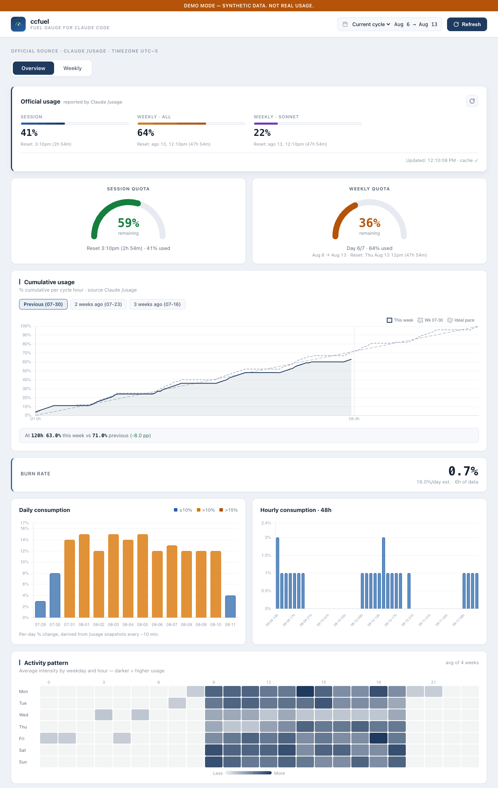
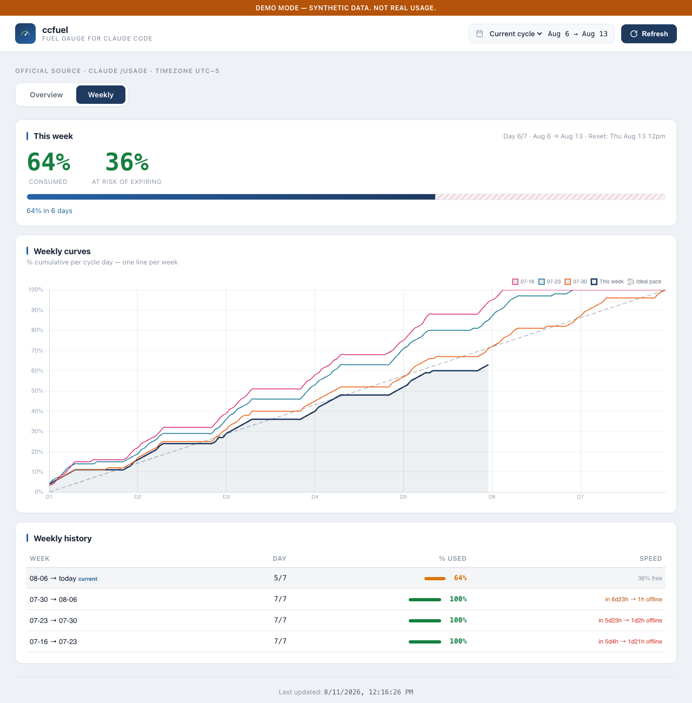
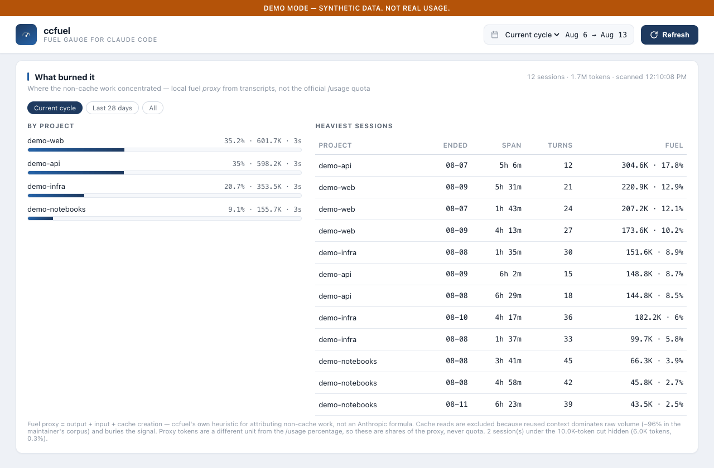

<p align="center">
  
</p>

<p align="center">
  <a href="https://github.com/ronaldmego/ccfuel/actions/workflows/ci.yml"></a>
  <a href="LICENSE"></a>
</p>

**Fuel gauge for Claude Code.** Read your weekly quota from Claude's own `/usage` gauge, then see **where the work went** — per project and per session — without raw token totals dominated by cache reads burying the signal.

> Stop guessing. Know how much Claude Code fuel you have left, and what took it.

## Why This Exists

Claude Code has a weekly limit. Burn it and you're locked out until reset. The CLI will tell
you *how much* is gone if you keep typing `/usage`; it will not tell you *what took it*, and
the raw token counts in your local transcripts are dominated by cache reads, which makes them
useless as an attribution signal (in my own corpus, ~96% of token volume — see below).

So ccfuel keeps two things apart, and the separation is the whole design:

| | Source | Answers | Status |
|---|---|---|---|
| **Official gauge** | Claude `/usage`, read via PTY | *How much* of the quota is gone | Authoritative — Anthropic's own number |
| **Local fuel proxy** | Your session transcripts | *Where* the non-cache work concentrated | A heuristic ccfuel computes. Not an Anthropic formula |

**What it tells you:**

- **How much fuel is left** — weekly % straight from Claude `/usage`
- **Your burn rate** — pace across the cycle, from `/usage` snapshots over time
- **When you'll run out** — projection from that measured pace
- **Where the non-cache work went** — fuel-proxy shares by project and by session

## The fuel proxy (and what it is not)

**Formula:** `fuel = outputTokens + inputTokens + cacheCreationTokens`

This is **ccfuel's own attribution proxy**, not a published Anthropic formula, and it is
deliberately not convertible into quota percent.

| Token counter | In the proxy? | Why |
|-----------|----------|-----|
| outputTokens | Yes | Generated content — never cached, always new work |
| inputTokens | Yes | Uncached context sent on this turn |
| cacheCreationTokens | Yes | Writing new content into the cache — new work, and priced *above* base input on the API |
| **cacheReadTokens** | **No** | Reused cached context. Dominates raw volume and drowns out the signal (~96% in the corpus below) |

**Why cache reads are excluded — carefully stated.** Reusing cached context is treated
favorably: Anthropic's usage-limit guidance says cached project content "doesn't count against
your limits when reused" and that "only new/uncached portions count against your limits", and
on the API cache reads bill at **0.1× the base input token price** rather than full price.
That is favorable treatment at a reduced rate, and Anthropic publishes **no formula** mapping
Claude Code's four transcript counters onto the weekly percentage. So the proxy leaves cache
reads out for exactly two stated reasons — favorable treatment, and dominant volume that buries
the signal. It makes no claim about what Claude Code charges you.

**Two units, never mixed.** Fuel-proxy tokens and quota percent are different units. The panel
reports **shares** ("this project took 35% of the non-cache tokens you burned"), never "this
session used N% of your week". Converting between them would need Anthropic's private
weighting, which is not published.

**The ~96% is an observation, not a constant.** Measured across 1,778 real sessions on the
maintainer's own machine. Your corpus will differ with how you work; nothing in the code
depends on the figure.

**Sources**

- Prompt caching pricing (cache reads at 0.1× base input): <https://platform.claude.com/docs/en/build-with-claude/prompt-caching#pricing>
- Usage limits and cached content: <https://support.claude.com/en/articles/9797557-usage-limit-best-practices>

On the arithmetic: the four counters are **disjoint totals**, not nested. Writing the proxy as
`input - cacheRead` looks equivalent and is not — it mixes separate counters and goes negative
whenever cache reads dominate. Sum the terms; never subtract. See `TECHNICAL-NOTES.md` for the
full methodology.

## Screenshots

All three are **synthetic demo data** from `npm run demo` — not real usage. That is what the
orange banner across the top says, and it is pinned so it cannot scroll out of a capture.


*Overview — official `/usage` gauges, cumulative curve against previous cycles, burn rate, daily and hourly consumption, and the activity heatmap. Synthetic data.*


*Weekly — cycle progress, one cumulative curve per cycle, and weekly history: which cycles hit 100% and how many hours they spent locked out. Synthetic data.*


*What burned it — the local fuel **proxy**: shares by project and the heaviest sessions, from your transcripts rather than `/usage`. Project labels here (`demo-api`, `demo-web`, …) are invented; on a real instance they are your own project directories. Synthetic data.*

## Stack

```
Node.js + Express
Frontend: Vanilla HTML/CSS/JS + Chart.js (single index.html, no build step)
           served entirely from localhost — no CDN, no webfont, no outbound request
Data: Claude /usage (via PTY) — periodic % snapshots
Process Manager: PM2 (optional)
```

## Prerequisites

- **Node.js 22 or newer.** Tested on 22 LTS, 24 LTS and 25 (see `engines` in `package.json`).
  Earlier lines are past end-of-life and are not tested.
- **Claude Code** installed, authenticated, and having trusted the folder the server runs in
  (see [Troubleshooting](#troubleshooting) — this one bites on first run).
- **A C++ toolchain, on Linux only.** `node-pty` is a native module. It publishes prebuilt
  binaries for macOS and Windows, so those install without a compiler; there is no Linux
  prebuild, so Linux compiles from source:

| OS | Needs build tools? |
|----|--------------------|
| macOS | No — prebuilt binary ships in the package |
| Windows | No — prebuilt binary ships in the package |
| Ubuntu/Debian | Yes — `sudo apt install build-essential python3` |

## Quick Start

Tested on macOS and Linux with Claude Code installed ([full matrix](LIMITATIONS.md#platform-support)). Reads `~/.claude/` logs automatically.

```bash
git clone https://github.com/ronaldmego/ccfuel.git
cd ccfuel

npm ci          # `npm ci` installs exactly the locked dependency set
node server.js
```

Open `http://localhost:3400`. The dashboard reads your local Claude Code transcripts and
fetches account-level usage by driving `/usage` in a PTY.

**First run:** Claude Code trusts folders one at a time, and the trust prompt swallows the
keystrokes ccfuel types. If the gauge stays empty, run `claude` once inside the ccfuel folder
and accept, or point `DASHBOARD_CLAUDE_CWD` at a folder you have already trusted. The
dashboard tells you which of the two it is — see [Troubleshooting](#troubleshooting).

### Take a screenshot without showing your own numbers

```bash
npm run demo     # http://localhost:3401
```

Builds a synthetic fixture in a fresh temp directory and serves it with both collectors off —
no PTY spawn, no transcript read — behind a "synthetic data" banner. Useful for screenshots,
issue reports and demos.

The fixture directory is created per run under the OS temp dir and removed when the demo exits.
**`DASHBOARD_DATA_DIR` is deliberately ignored here**: the demo overwrites a fixed set of
filenames, so honouring it would let `npm run demo` destroy the snapshots of anyone who had
configured a real data directory. There is no flag to override that — looking at the UI does not
need write access to real data.

### Optional: PM2 for background running

```bash
cp ecosystem.config.example.cjs ecosystem.config.cjs
pm2 start ecosystem.config.cjs
```

### Optional: Custom configuration

Every setting is an environment variable. Nothing reads `.env` implicitly — pass it to Node
yourself:

```bash
cp .env.example .env
# edit .env, then:
node --env-file=.env server.js
```

| Variable | Default | Description |
|----------|---------|-------------|
| `DASHBOARD_HOST` | `127.0.0.1` | Bind address |
| `DASHBOARD_PORT` | `3400` | Server port |
| `DASHBOARD_TIMEZONE` | `-5` | UTC offset in hours (`-5` EST, `+1` CET, `0` UTC). No DST. Used by the server, the frontend and the `/usage` reset parser |
| `DASHBOARD_DATA_DIR` | `./data` | Where snapshots are written. Created on boot if missing |
| `DASHBOARD_COLLECT_INTERVAL_MIN` | `20` | `/usage` auto-collector cadence in minutes. `0` disables it |
| `DASHBOARD_CLAUDE_CWD` | *(inherit)* | Folder to spawn `claude` in. Set it to a folder Claude Code already trusts |
| `DASHBOARD_SESSION_SCAN_INTERVAL_MIN` | `30` | Transcript scan cadence in minutes. `0` disables the "What burned it" panel |
| `DASHBOARD_SESSION_MIN_FUEL` | `10000` | Sessions under this many fuel tokens are treated as noise |
| `DASHBOARD_TRANSCRIPTS_ROOT` | `~/.claude/projects` | Where session transcripts live |
| `DASHBOARD_DEMO` | *(off)* | `1` serves `DASHBOARD_DATA_DIR` as-is and collects nothing. Set by `npm run demo`; never set it on a real instance |

## Architecture

### Single machine (default)

```
Claude Code (/usage PTY)  ──>  claude-usage.js  ──>  server.js  ──>  Dashboard
```

- **claude-usage.js** runs Claude Code's `/usage` command via PTY to get account-level percentages
- An in-process auto-collector in `server.js` fetches `/usage` and saves a snapshot to `data/usage-curve.json` every `DASHBOARD_COLLECT_INTERVAL_MIN` minutes (default 20), independent of whether the dashboard is open. It primes once ~5s after boot, retries once inside a cycle on failure, and is guarded against overlapping PTY spawns. Opening the dashboard or hitting `/api/global-usage` still triggers an on-demand refresh on top of the schedule.

### File Structure

```
ccfuel/
├── server.js           # Express server + PTY integration
├── claude-usage.js     # PTY wrapper for Claude /usage
├── reset-cycle.js      # Weekly reset cycle validation (guards weekId against misparses)
├── session-metrics.js  # Per-session fuel from local transcripts
├── public/
│   └── index.html      # Dashboard (all inline: HTML, CSS, JS)
├── scripts/
│   ├── demo.js               # `npm run demo` — serve synthetic data for screenshots
│   ├── synthetic-fixture.js  # the fixture generator (shared with the smoke test)
│   └── fix-pty-permissions.js # postinstall: restore node-pty's spawn-helper exec bit
├── test/               # Dependency-free tests + PTY and server smokes (npm test)
├── data/               # Local snapshots (gitignored, created at runtime)
│   ├── weekly-history.json   # Weekly efficiency snapshots
│   ├── usage-curve.json      # Periodic % snapshots
│   ├── resets-cache.json     # Last accepted reset per cycle (the weekId anchor)
│   └── session-metrics.json  # Per-session fuel + scan cache (mtime-keyed, schema-versioned)
├── TECHNICAL-NOTES.md  # Measurement methodology
├── LIMITATIONS.md      # Known limitations
└── package.json
```

### API Endpoints

| Endpoint | Method | Description |
|----------|--------|-------------|
| `/` | GET | Dashboard HTML |
| `/api/refresh` | GET | Redirects to `/api/global-usage/refresh` |
| `/api/global-usage` | GET | Real global usage (Claude /usage via PTY) |
| `/api/global-usage/refresh` | GET | Force refresh global usage |
| `/api/usage-curve` | GET | Periodic % snapshots (for weekly comparison) |
| `/api/usage-deltas` | GET | Derived consumption from % deltas (rate, projection, daily, hourly, heatmap, curves) |
| `/api/weekly-history` | GET | Weekly efficiency history |
| `/api/config` | GET | Configuration (timezone, demo flag) |
| `/api/session-metrics` | GET | Per-session fuel by project and heaviest sessions (`?window=cycle\|28d\|all`, `?top=N`) |
| `/api/session-metrics/refresh` | GET | Force a transcript rescan |

**Global Usage:** Executes Claude Code via PTY (~6s on the happy path, 35s hard timeout),
cached 5 min. Returns `session%`, `weekAll%`, `weekSonnet%`, `extraUsage`.

A read either succeeds or says why. `success: true` means the weekly percentage parsed — the
one field that is never defaulted, so a real `0%` is distinguishable from a failed read.
`success: false` carries a `failureKind` (`trust-prompt`, `login-required`, `timeout`,
`exited-early`) and a message; a failed read never overwrites the last good value.
`session.percent` and `weekSonnet.percent` still default to `0` for backwards compatibility,
so a `0` from those two is not evidence of a real zero.

**Usage Curve:** Each successful global-usage fetch saves a snapshot to `data/usage-curve.json` (%, hour, cycle day). Auto-pruned to last 28 days.

### Dashboard Tabs

Two tabs. Everything on the Overview tab is one scrolling page, not separate views.

- **Overview** — *Official usage* (session %, weekly all, weekly Sonnet, straight from
  `/usage`) and the session/weekly gauges, source `/api/global-usage`. Then, derived from the
  % deltas between snapshots (source `/api/usage-deltas`): *Cumulative usage* per cycle hour
  against the previous cycles and an ideal pace, *Burn rate* with a depletion estimate, *Daily
  consumption* (14 days), *Hourly consumption* (48h) and the *Activity pattern* heatmap by
  weekday and hour. Last, *What burned it* — the **fuel proxy** by project and the heaviest
  sessions, computed from the local transcripts rather than read from `/usage`: the official
  gauge says *how much* is gone, this estimates *where the non-cache work concentrated*. It
  reports shares of the proxy, never quota percent — different units, not convertible (see
  `LIMITATIONS.md`). Source `/api/session-metrics`.
- **Weekly** — cycle progress for the current week, cumulative curves per cycle, and weekly
  history including when a cycle hit 100% and how long it was locked out. Source
  `/api/weekly-history` plus `curves` from `/api/usage-deltas`.

## Critical Components

### claude-usage.js — The Data Engine

`claude-usage.js` is the **single most critical file** in this project. It is the data extraction layer — without it, the entire dashboard shows 0% on everything. The UI is just presentation; this file is the engine.

#### How it works

```
node-pty spawns `claude` with no MCP servers → retypes `/usage` until the echo appears on
screen → presses Enter → resolves as soon as parseUsageOutput() succeeds
→ returns JSON with session%, weekAll%, weekSonnet%
```

There is no non-interactive way to get this: the CLI has no `claude usage` subcommand, so
scraping the TUI is the only route. That makes the spawn the expensive part of the whole
project, and two decisions keep it honest:

- **No MCP servers** (`--strict-mcp-config` + an empty `--mcp-config`). The session only
  types a slash command and never calls a tool, but a default spawn boots every MCP server
  the user has configured. On a host with Playwright MCP that was a second process of
  ~162 MB per fetch, for nothing.
- **The two waits that used to break it are now event-driven**: the keystroke is retried until
  its echo appears on screen, and the fetch resolves when `parseUsageOutput()` succeeds — not
  when a wording match or a fixed deadline says so. The remaining timers are deliberate and
  bounded, not guesses about how long the TUI takes: a 4 s delay before the first keystroke, a
  1.5 s retry interval that stops the moment the echo arrives, a 400 ms pause after the echo so
  the autocomplete finishes drawing, a 2 s settle after the first successful parse, and the 35 s
  hard timeout as a backstop. See the history below for why the difference matters.

#### What it costs per fetch

Measured on a 12-core VPS, collector at its default 20-minute interval:

| | Value |
|---|---|
| process lifetime | ~6 s |
| RSS | ~327 MB (one process) |
| CPU (user+sys) | ~9.7 s |
| tokens | **zero** — `/usage` is a local slash command; no prompt is ever sent to the model |

The RAM figure is a spike, not a leak: the process is killed at the end of each fetch, and
that kill reaps the child tree with it. Spawning a full CLI is inherent to the approach —
what is *not* inherent is holding it longer than needed, which is why the early-exit
condition is load-bearing rather than an optimization.

#### What can break it

| Risk | Detail |
|------|--------|
| Claude CLI updates | Output format or slash command behavior may change. Timing changes are now absorbed by the echo/parse gates |
| `CLAUDE*` env vars | Must be filtered out or Claude refuses to start (nested session detection) |
| Matching the TUI's **wording** | The early-exit condition must key off the *parse succeeding*, never off a specific string. A wording match that silently stops matching does not fail loudly — it degrades into "always hits the 35s timeout" while still returning correct data |
| Startup flags | `--bare` looks ideal and is not: it ignores OAuth and the keychain by design (API key only), which breaks the very subscription quota this reads. `--disable-slash-commands` disables the one thing the fetch does |
| Timeout (35s) | Now a genuine backstop rather than the normal path. A fetch that reaches it means `/usage` never rendered; the raw buffer is dumped to the log so it can be diagnosed |
| Folder trust | Claude Code trusts folders one at a time and asks before working in an unknown one. That prompt eats the keystrokes. Detected by name (`failureKind: trust-prompt`) and never answered automatically — accepting a trust prompt is the user's decision, not a dashboard's |
| node-pty packaging | It is a Node-API addon, so one binary works across Node versions — no rebuild after a Node upgrade. The real trap is macOS: the published prebuild's `spawn-helper` is not executable, and every spawn then fails with `posix_spawnp failed.` A `postinstall` restores the bit; see `scripts/fix-pty-permissions.js` |

#### Rules before modifying

1. **Always run `node claude-usage.js --debug` first**
2. **Check `/tmp/claude-usage-debug.log`** for raw PTY output if something looks wrong
3. **If `/usage` output format changes**, only `parseUsageOutput()` needs updating — PTY spawn logic should remain stable
4. **Test from PM2 context too** — env vars differ between interactive shell and PM2

#### History

- **Pre-2026-03-01:** Used `execSync('claude usage')` which was never a valid CLI command. Worked by accident until it stopped.
- **2026-03-01:** Rewritten to use node-pty with interactive `/usage` slash command.
- **2026-08-08:** Cut from 35 s to ~6 s per fetch. Three findings worth keeping, because each
  one hid behind correct-looking output:
  - The early-exit condition required the string `extra usage`, which that account's panel
    never renders. So it never fired and **every** fetch ran the full 35 s timeout — while
    still returning the right numbers, because the timeout handler parses too. A cost bug
    with no symptom. The gate is now `parseUsageOutput().success`.
  - `/usage` was typed on a fixed 4 s timer. When the TUI had painted its banner but was not
    yet accepting input, the keystroke was swallowed with no error to react to, `/usage`
    never echoed, and the fetch burned 35 s on ~891 captured bytes. That was the recurring
    ~15 % failure — not an expired login. The fix is to retype until the echo appears.
  - The spawn loaded every configured MCP server (523 MB, two processes) to type one slash
    command it never used a tool for.

## Troubleshooting

The gauge is empty, or `/api/global-usage` returns `success: false`. Read `failureKind`:

| `failureKind` | What happened | Fix |
|---|---|---|
| `trust-prompt` | Claude Code is asking whether to trust the folder ccfuel spawned it in, and the prompt is eating the `/usage` keystrokes | Run `claude` once in that folder and accept, or set `DASHBOARD_CLAUDE_CWD` to a folder you already trust |
| `login-required` | Claude Code is not authenticated | Run `claude`, complete `/login`, retry |
| `timeout` | The panel never rendered within 35s | The raw buffer is in the server log; check whether `/usage` looks different from what `parseUsageOutput()` expects |
| `exited-early` | `claude` exited before the panel appeared | Usually a CLI error on startup — run `node claude-usage.js --debug` |

`Error: posix_spawnp failed.` on macOS means node-pty's `spawn-helper` lost its executable
bit. `npm ci` repairs it via `postinstall`; to check by hand, `npm test` reports the mode.

`Cannot find module 'node-pty'` means the install did not complete — re-run `npm ci`.

## Testing

```bash
npm test
```

Pure-function tests, the `/usage` parser against synthetic captures, a PTY spawn round-trip
(no Claude Code needed), and a real `node server.js` boot over the synthetic fixture. The last
two exist because a suite of pure functions plus `node --check` stayed green through both
failures that made the published Quick Start unusable — a missing dependency and a native
module that could not spawn. CI runs the whole thing on Linux and macOS, on Node 22 and 24.

## Documentation

| File | Contents |
|------|----------|
| `TECHNICAL-NOTES.md` | Measurement methodology: real fuel vs cache reads |
| `LIMITATIONS.md` | Known limitations (PTY dependency, timezone) |

## Design Philosophy

- **Zero build step** — No React, no webpack. Vanilla JS + Chart.js.
- **Local-first, literally** — the dashboard loads no remote resource. Chart.js is served from
  `node_modules` at `/vendor/chart.umd.js`; fonts fall back to system families. Opening the page
  makes no request to any other host. See `SECURITY.md`.
- **Three dependencies** — Express; `node-pty`, because there is no non-interactive way to read
  `/usage`; and `chart.js`, served locally rather than from a CDN so the page stays offline-clean
  and the version is pinned in the lockfile. All three are load-bearing; nothing else is.
- **Official numbers stay official** — the quota gauge is Anthropic's own `/usage` figure. The
  transcript-derived attribution is labelled a proxy everywhere it appears, and the two units are
  never mixed or converted.
- **Validated where it is tested** — macOS and Linux, Node 22 and 24 in CI. Windows is untested
  rather than supported; the honest matrix is in [`LIMITATIONS.md`](LIMITATIONS.md#platform-support).

## Note

This is a personal project, open for anyone who wants to try it. Requires a **Claude Pro or Max subscription** with Claude Code installed and authenticated. The dashboard reads local log files and the CLI's built-in usage display to automate what you'd otherwise check manually. It is not affiliated with or endorsed by Anthropic, and the fuel proxy is ccfuel's own heuristic — for the authoritative number, the `/usage` panel and Anthropic's own usage settings are the source.

## License

MIT

## Contributing

PRs welcome! Open an issue first for major changes.
